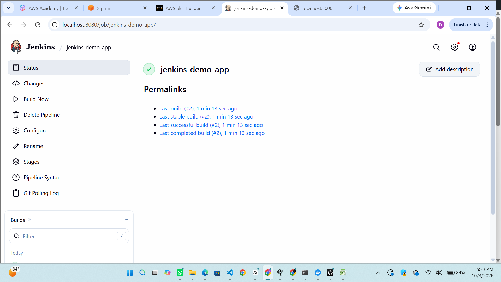
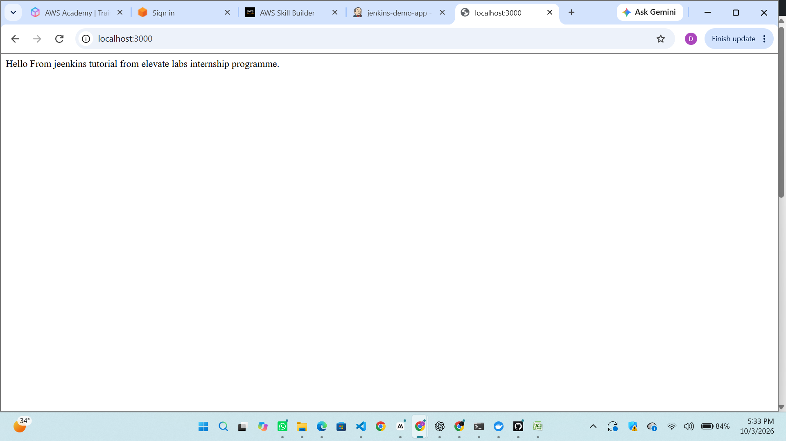

# Jenkins CI/CD Pipeline

## What I built
A Jenkins pipeline that builds, tests and deploys a Node.js app in Docker.

## Tools
Jenkins, Docker, Node.js, GitHub

## Pipeline stages
1. Checkout: pulls code from GitHub
2. Build: builds the Docker image
3. Test: runs `npm test` inside the image
4. Deploy: runs the container on port 3000

## How to run
1. Start Jenkins in Docker and install the Docker CLI inside it
2. Create a Pipeline job using "Pipeline script from SCM"
3. Push a commit; Jenkins polls GitHub every 2 minutes and runs the pipeline

## Screenshots

